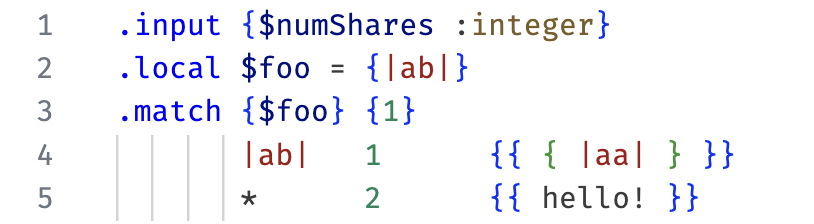

# MessageFormat 2 for VS Code

This extension adds syntax highlighting support for MessageFormat 2 messages
contained in `.mf2` files.

To use this extension, open a file containing a MessageFormat 2 message, and
select the `MessageFormat 2` language after running the `> Change Language Mode`
command from the Command Palette
(<kbd>Ctrl/Cmd</kbd>+<kbd>Shift</kbd>+<kbd>P</kbd>). Files ending in `.mf2` are
automatically highlighted as `MessageFormat 2`.

In JavaScript files, template strings inside of a `new Intl.MessageFormat()`
expression (or `new MessageFormat`) will be highlighted. Template strings
prefixed with `/* mf2 */` are also highlighted.

### Examples

<table><tr><td style="width:50%">

```mf2
.input {$numShares :integer}
.local $foo = {|ab|}
.match {$foo} {1}
       |ab|   1      {{ { |aa| } }}
       *      2      {{ hello! }}
```

</td><td>



</td></tr><tr><td>

```ts
const message = new Intl.MessageFormat(
  "en",
  `Hello, { $name :fallback value=|World| }!`,
);
```

</td><td>


</td></tr><tr><td>

```ts
const message = /* mf2 */ `
  .input {$count :number}
  .match {$count}
    0   {{No new notifications}}
    one {{{$count} new notification}}
    *   {{{$count} new notifications}}
`;
```

</td><td>


</td></tr></table>
